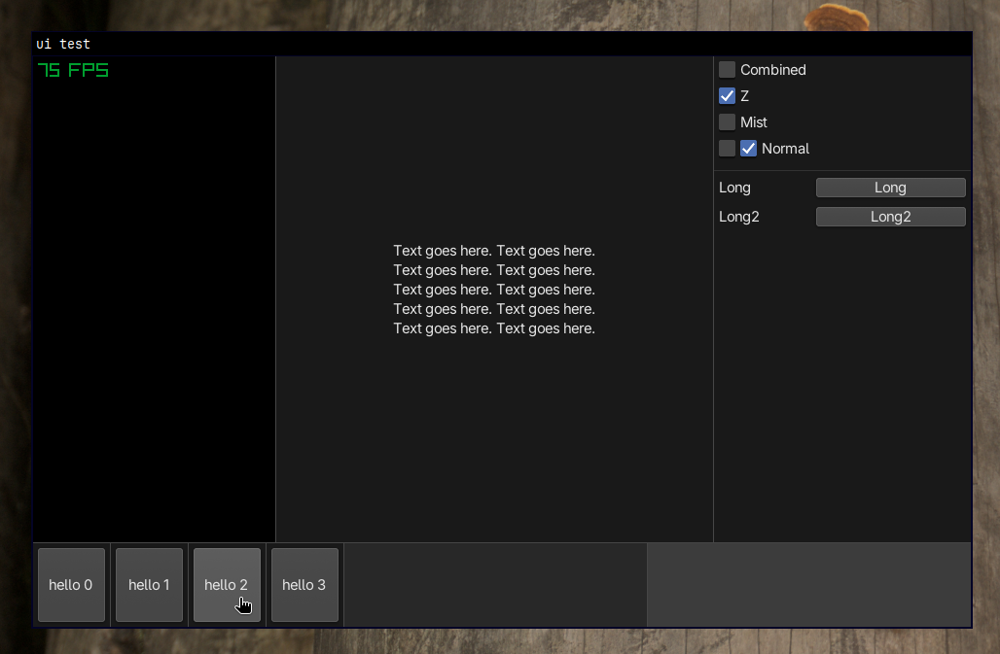

## TODO
- Change button gradient to a dithered gradient?

Debug menu ideas (bonus points: make it a separate window):
- Disable scissor draw limit
- Rootnode draw in middle (x+50, y+50, w-100, h-100 kinda thing)
- Resize bar draw dropdown setting [dont draw, transparent, normal]
- Middle click on any element to see its properties and edit them

</img>

The included [AdwaitaSans-Regular](ui/fonts/Adwaita/AdwaitaSans-Regular.ttf) font is licensed under the OFL-1.1. A copy of this license is included [here](ui/fonts/Adwaita/LICENSE).
